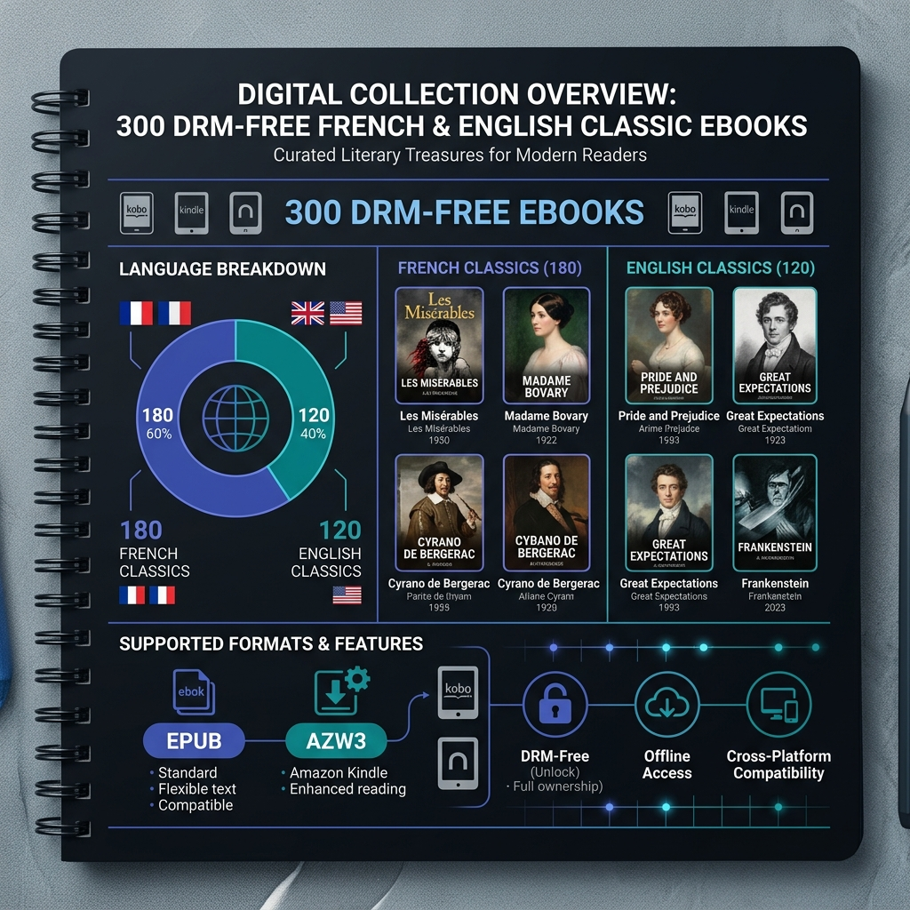
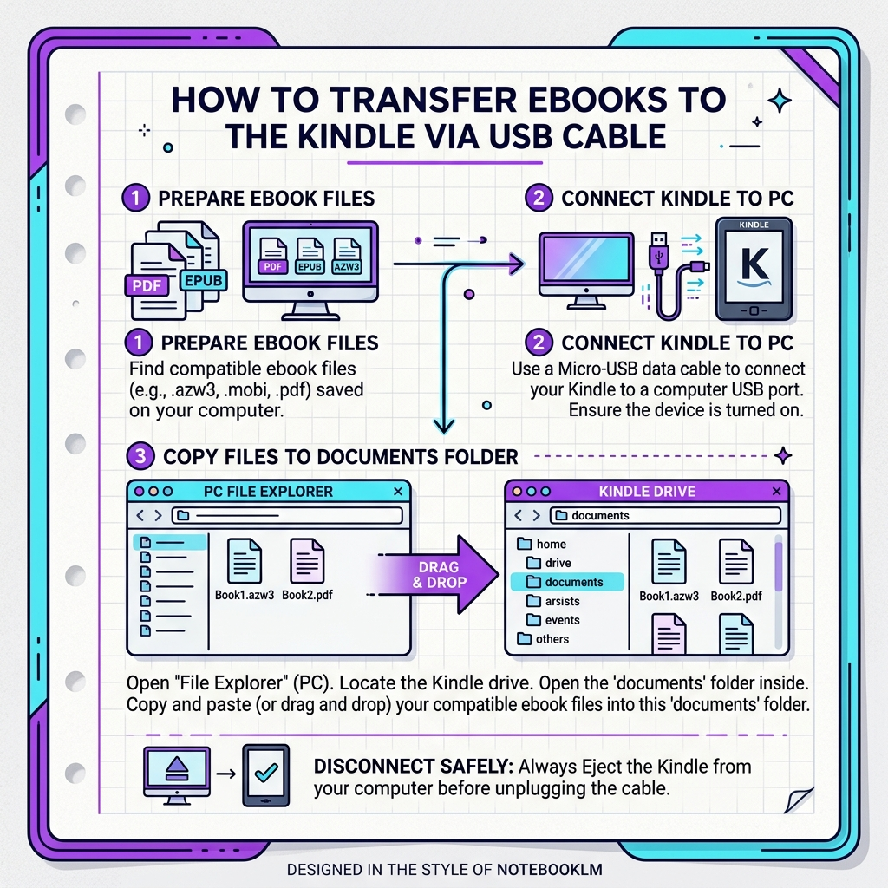

# 📚 Top 300 DRM-Free Classic Ebooks Collection & Device Packs

[](https://github.com/philippehenin/ebooks/releases/tag/v1.0.0)
[](https://creativecommons.org/publicdomain/mark/1.0/)
[](#-curated-literary-catalog)
[](#-curated-literary-catalog)
[](#-technical-context--the-kindle-usb-mystery-solved)

A curated, DRM-free digital library of **300 French and English literary classics**, pre-formatted and optimized for **Amazon Kindle 10th Gen** (native `.AZW3`), **X3/X4 E-ink readers** (Onyx Boox, Kobo, Meebook, PocketBook), and modern web apps. Includes step-by-step **NotebookLM visual infographics** and installation guides.

---

## 📖 Table of Contents

- [💡 Technical Context & The Kindle USB Mystery Solved](#-technical-context--the-kindle-usb-mystery-solved)
- [✨ Key Features](#-key-features)
- [📚 Master Literary Catalog (Markdown)](CATALOG.md)
- [🖼️ NotebookLM Visual Infographics](#%EF%B8%8F-notebooklm-visual-infographics)
- [📦 Downloadable Device Packs (Releases)](#-downloadable-device-packs-releases)
- [🚀 Quick Start & Installation Recipe](#-quick-start--installation-recipe)
- [🗺️ Recommended Reading Roadmap](#%EF%B8%8F-recommended-reading-roadmap)
- [💻 Web Catalog Explorer](#-web-catalog-explorer)
- [🛠️ Automated Python Tools & Scripts](#%EF%B8%8F-automated-python-tools--scripts)
- [⚖️ License & Copyright](#%EF%B8%8F-license--copyright)

---

## 💡 Technical Context & The Kindle USB Mystery Solved

> **Why didn't raw `.EPUB` files show up when transferred over USB cable to a Kindle?**  
> Amazon Kindle devices enforce strict indexing rules over cable connections. When connected via **USB cable**, Kindles **ONLY index native Amazon `.AZW3`** (Kindle Format 8) or `.MOBI` files. Raw `.EPUB` files get silently ignored over USB cable.  
>  
> ✨ **Solution**: We ran a multi-threaded parallel converter script powered by Calibre to convert **all 293 classic ebooks into native Amazon `.AZW3` format**, ensuring instant recognition and perfect typography on all Kindle devices!

---

## ✨ Key Features

- **300 DRM-Free Literary Treasures**: 180 French classics (Dumas, Hugo, Verne, Leblanc, Flaubert, Maupassant) and 120 English classics (Conan Doyle, Austen, Dickens, Shelley, Fitzgerald).
- **Kindle 10th Gen Pack (Native `.AZW3`)**: Pre-converted native Amazon Kindle files for direct drag-and-drop via USB cable into the `documents/` folder.
- **X3 / X4 E-ink Reader Pack**: Cleanly categorized `.EPUB` folder hierarchy (`01_French_Classics`, `02_English_Classics`) tailored for Onyx Boox, Kobo, Meebook, and PocketBook readers.
- **Master Library Pack**: Complete library archive with rich JSON metadata catalog.
- **NotebookLM Infographics**: High-resolution visual diagrams and PDF installation guides formatted without character corruption.
- **Interactive Web App**: Modern web catalog viewer (`index.html`) with real-time search, category filtering, language toggles, and metadata inspection.

---

## 🖼️ NotebookLM Visual Infographics

### 1. Digital Collection Overview


### 2. Kindle USB Transfer Step-by-Step Guide


---

## 📦 Downloadable Device Packs (Releases)

Download ready-to-use zip archives directly from our [**GitHub Release v1.0.0**](https://github.com/philippehenin/ebooks/releases/tag/v1.0.0):

| Device Pack | Format | Target Devices | Release Download |
| :--- | :---: | :--- | :---: |
| **Kindle 10th Gen Pack** | `.AZW3` | Amazon Kindle (All generations) via USB | [📥 Download (167 MB)](https://github.com/philippehenin/ebooks/releases/download/v1.0.0/Kindle_10th_Gen_Pack_top300.zip) |
| **X3 / X4 Eink Reader Pack** | `.EPUB` | Onyx Boox, Kobo, Meebook, PocketBook | [📥 Download (125 MB)](https://github.com/philippehenin/ebooks/releases/download/v1.0.0/X3_X4_Eink_Reader_Pack.zip) |
| **Top 300 Master Pack** | `.EPUB` + JSON | Calibre, Apple Books, PC / Mac | [📥 Download (125 MB)](https://github.com/philippehenin/ebooks/releases/download/v1.0.0/Top_300_Ebook_Master_Pack.zip) |

---

## 🚀 Quick Start & Installation Recipe

### Option 1: Direct USB Cable Transfer (Recommended for Kindle)

1. **Extract your Pack**: Unzip `Kindle_10th_Gen_Pack_top300.zip`.
2. **Connect your Kindle**: Connect your Kindle to your computer using a USB cable. Open your file explorer and locate the `Kindle` drive.
3. **Copy to `documents/`**: Drag the `French_Classics` and `English_Classics` folders directly into your Kindle's `documents/` folder:
   ```text
   Kindle (Drive) 📁
    └── documents/ 📁
         ├── French_Classics/ 🇫🇷 (Monte-Cristo, Les Misérables, Lupin...)
         └── English_Classics/ 🇬🇧 (Sherlock Holmes, Frankenstein, Gatsby...)
   ```
4. **Eject & Read**: Safely eject your Kindle USB drive, unplug the cable, and enjoy 293 DRM-free classics ready on your home screen!

### Option 2: Wireless Transfer (Send to Kindle)

1. Visit [amazon.com/sendtokindle](https://www.amazon.com/sendtokindle).
2. Drag and drop `.epub` files from the `X3_X4_Eink_Reader_Pack` or `Master_Library_Pack`.
3. Click **Send** to deliver wirelessly to your Kindle account.

---

## 🗺️ Recommended Reading Roadmap

Not sure where to begin? Try these 4 curated reading paths:

* **⚡ Path 1: High-Octane Page-Turners**  
  *Arsène Lupin, Gentleman-Cambrioleur* (Leblanc) ➔ *Sherlock Holmes: A Study in Scarlet* (Conan Doyle) ➔ *Le Comte de Monte-Cristo* (Dumas).
* **👑 Path 2: Grand Historical Epics**  
  *Les Trois Mousquetaires* ➔ *Vingt Ans Après* ➔ *Le Vicomte de Bragelonne* (Dumas) ➔ *Les Misérables* (Hugo).
* **🔬 Path 3: Sci-Fi & Gothic Mysteries**  
  *Frankenstein* (Shelley) ➔ *Dracula* (Stoker) ➔ *Le Mystère de la chambre jaune* (Leroux) ➔ *Vingt Mille Lieues sous les mers* (Verne).
* **🎭 Path 4: Social Wit & Masterpiece Novels**  
  *Pride and Prejudice* (Austen) ➔ *Madame Bovary* (Flaubert) ➔ *Great Expectations* (Dickens) ➔ *The Great Gatsby* (Fitzgerald).

---

## 💻 Web Catalog Explorer

This repository includes a standalone local web application to browse, search, and filter the catalog:

1. Open `index.html` in any web browser.
2. Filter books by language (French / English), genre, author, or download status.

---

## 🛠️ Automated Python Tools & Scripts

- `build_device_packs.py` — Organizes downloaded ebooks into categorized device pack folders.
- `convert_kindle_azw3.py` — Parallel multi-threaded conversion script using Calibre CLI to output native `.AZW3`.
- `build_beautiful_pdf_guide.py` — HTML & CSS template generator that builds styled UTF-8 PDF installation guides.
- `verify_and_generate_pdfs.py` — Validation script verifying readable file headers across all formats.

---

## ⚖️ License & Copyright

All literary works in this repository are in the **Public Domain** under international copyright laws (original texts published prior to 1928/1929). The custom scripts, layout formatting, and guides are released under the [MIT License](LICENSE).
